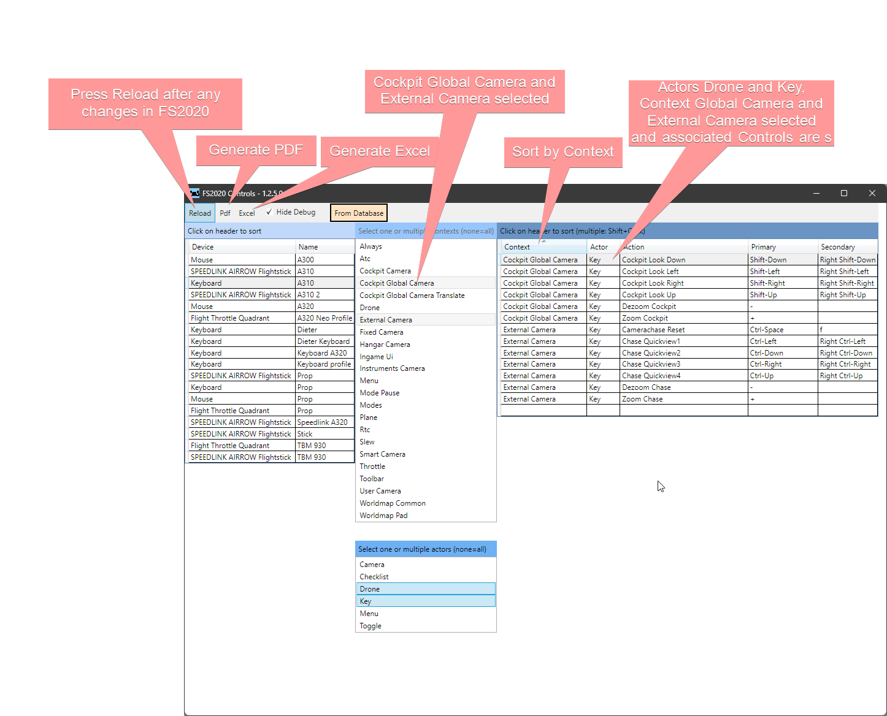

# FS2020Control: Export Control Settings in Microsoft FS2020 to SQLite, Excel and Pdf

[dieter.menne\@menne-biomed.de](mailto:dieter.menne@menne-biomed.de)

Getting an overview of the assigned keys for keyboard, mouse, flight stick in Microsoft 
Flight Simulator 2020 is not easy. The local copies of the control settings are stored 
in a file with path like:

    C:\Users\MyName\AppData\Local\Packages\
    Microsoft.FlightSimulator_8wekyb3d8bbwe\
    SystemAppData\wgs\
    000901F9BE5269E8_00000000000000000000000069F80140\
    9D40C7EC95724C16A62F4153D13B14B9\
    C6A6EACA3129423E8E4E42B33DE3BFCF

*the above is ONE LINE*. 

Whenever changes are made in the control settings, the device's settings file is deleted and 
replaced by another file with cryptic name.

In short: Microsoft does not want us to mess with it, and may change everything without notice.

## Installation

Releases are on [flightsim.to](https://flightsim.to/d/dmenne/fs2020-control).

- Unzip SetupFS2020Control.zip into a temporary directory
- Double-click `setup.exe`
- You can delete all temporary files after installation

## What the app does

-   Tries to find the settings files of the controls and scans all - I am not sure if this will work in all installations;
-   Writes all settings into an SQLite Database, which can be used by advanced users to generate custom reports;
-   Displays all control settings, allows for a subset selection and sort order for reporting;
-   Generates a PDF reference sheet;
-   Generates an Excel file with sortable and selectable entries.

Database, Excel and PDF file are stored in directory `Documents/FS2020Key` 
with names such as `FS2020Controls_Mouse_A300.pdf`. The directory is created when it does not exist.

## Main Window

**Do not forget to click *Reload* after any changes you made to the control settings in FS2020.**

## Generated output

### PDF

Example file name:

`C:\Users\<Username>\Documents\FS2020Keys\FS2020Controls_Mouse_A300.pdf`

### Excel

Example file name: 

`C:\Users\<Username>\Documents\FS2020Keys\FS2020Controls_Keyboard_A310.xlsx`

### Database

Example file name: 

`C:\Users\<Username>\Documents\FS2020Keys\FS2020.sqlite`

## Advanced 

When you double-click an item in the upper left data grid, you can select to open the file 
with the control settings with Notepad, or copy the gargantuan file name to the clipboard 
for processing in other editors. 

Any changes using the external editor are at your own risk. Edits may or may not 
do what you expect, worst case scenario is that all settings for the device are lost, 
so better work on a clone made in FS2020.

Do not be surprised when you XML-editor claims that the file is not valid XML - 
while the header insists that the content is XML, there is no root level element as 
required by the norm. For internal processing, the app temporarily adds a root 
level element - see function `MakeValidXml` in `XmlToSqlite.cs`.

